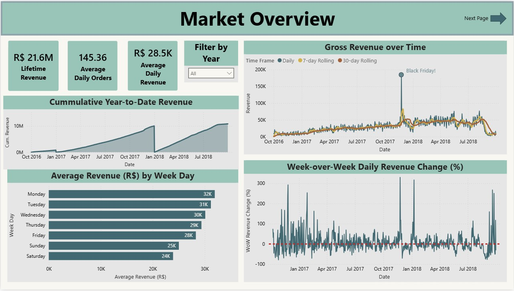
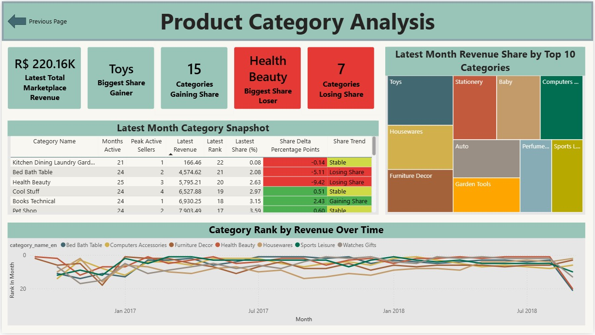

This project builds a data pipeline and Power BI dashboard on top of the [Olist Brazilian E-Commerce](https://www.kaggle.com/datasets/olistbr/brazilian-ecommerce) dataset. Raw Kaggle data is downloaded, enriched with synthetic messy records to simulate real-world data quality issues, cleaned into a DuckDB warehouse, and exported as CSVs for analysis in Power BI.

## Dashboard

**Page 1 — Market Overview**


**Page 2 — Seller Performance**


**Page 3 — Churn Risk**


**Page 4 — Product Category Analysis**


---

## How it works

```
Kaggle API
    │
    ▼
setup/01_import_data.py          # Download raw CSVs → data/
    │
    ▼
setup/03_generate_messy_data.py  # Append ~10% synthetic messy rows
    │
    ▼
pipeline/01_clean_and_load.py    # Clean -> DuckDB staging schema
pipeline/02_build_warehouse.py   # Build warehouse schema
pipeline/03_backfill.py          # Aggregate all date partitions
pipeline/04_validate.py          # Data quality checks
pipeline/05_export_query_results.py  # Export CSVs -> exports/
    │
    ▼
exports/*.csv  ──────────────►  Power BI Dashboard
```

The whole pipeline runs from a single command and takes around 2 minutes.

---

## Warehouse tables

| Table | Granularity | Description |
|---|---|---|
| `wh_daily_seller_revenue` | seller × day | Revenue, items sold, top category |
| `wh_daily_category_revenue` | category × day | Revenue, orders, active sellers |
| `wh_seller_monthly_cohort` | seller × month | Monthly revenue with cohort and lifecycle metrics |

---

## Power BI exports

| File | Rows | Used for |
|---|---|---|
| `seller_ranking.csv` | ~1,900 | Seller performance table and revenue quartile scatter |
| `revenue_trends.csv` | ~760 | Daily revenue, week-over-week growth, rolling averages |
| `churn_risk.csv` | ~2,100 | At-risk seller list with composite churn score |
| `category_mix.csv` | 22 | Category revenue share, latest month breakdown |
| `seller_total_revenue.csv` | ~3,400 | Top 20% seller revenue concentration KPI |
| `category_monthly_rank.csv` | ~1,300 | Category rank over time (bump chart) |

---

## Tech stack

Python, SQL (DuckDB), Power BI.

---

## Dataset

[Olist Brazilian E-Commerce](https://www.kaggle.com/datasets/olistbr/brazilian-ecommerce): roughly 100K orders placed on a Brazilian marketplace between October 2016 and September 2018, covering orders, sellers, products, payments, and customer locations.
