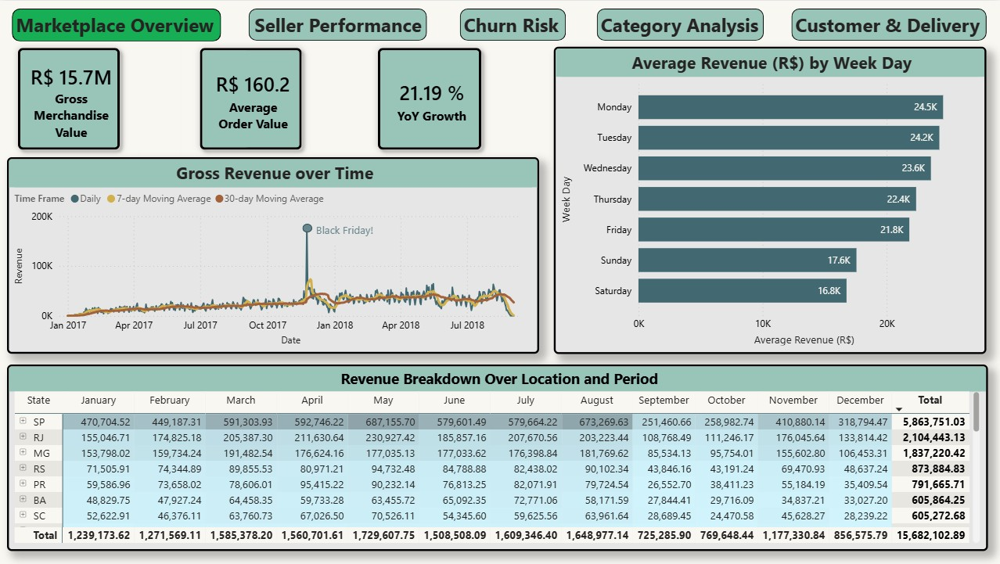
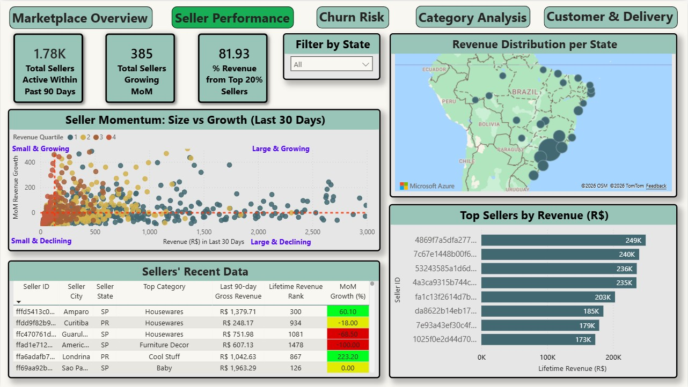
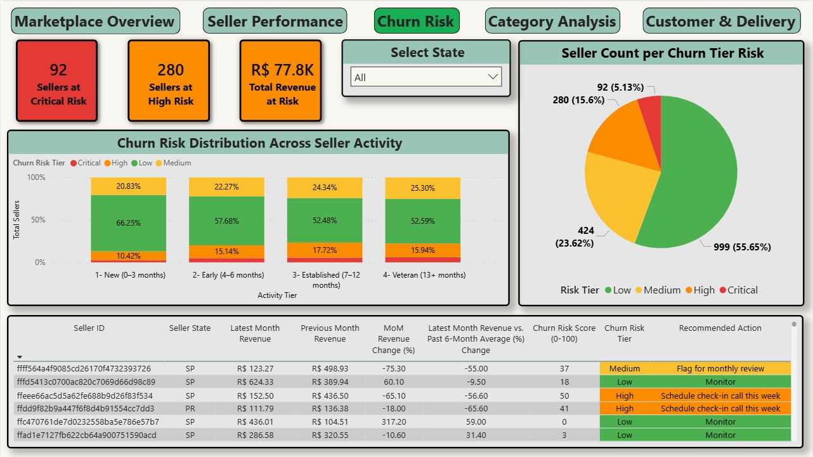
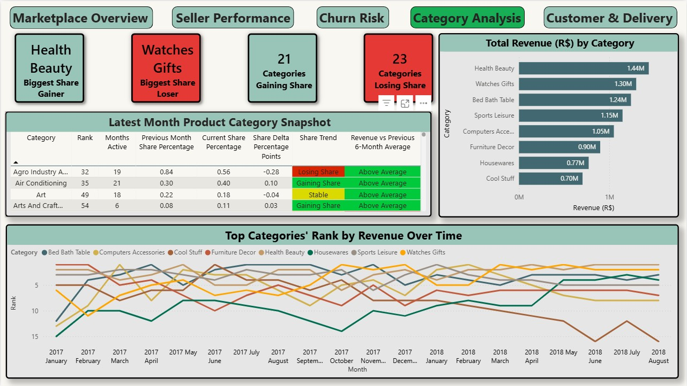
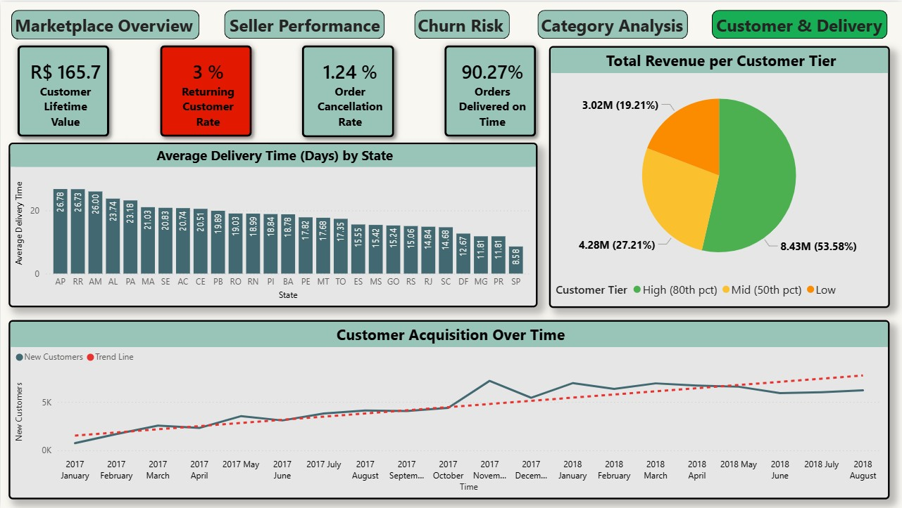

A Brazilian online marketplace ([Olist](https://www.kaggle.com/datasets/olistbr/brazilian-ecommerce)) connects ~3,000 independent sellers to consumers across the country. With over 100K orders across 74 product categories, the platform's core operational challenge is knowing **which parts of the business are healthy and which need attention** before problems show up in aggregate revenue.

This project builds a full analytics stack on top of the Olist dataset: a Python/DuckDB pipeline that ingests raw Kaggle data, runs a set of window-function-heavy SQL queries, and exports everything to a Power BI dashboard structured around five business questions.

## Dashboard

**Page 1 — Market Overview**


**Business question: Is the business growing, and when does it generate the most revenue?**

Before diving into sellers or categories, the first question any stakeholder asks is whether the top-line numbers are moving in the right direction. This page answers that with three lenses: headline KPIs, a revenue trend over the full dataset period, and a day-of-week breakdown.

**Visuals:**
- **KPI cards**: R$15.7M Gross Merchandise Value, R$160.2 Average Order Value, and 21.19% Year-over-Year revenue growth. These three numbers together capture scale, transaction quality, and momentum at a glance.
- **Gross Revenue Over Time**: a daily line chart overlaid with 7-day and 30-day moving averages. The raw daily signal is noisy, so the moving averages are able to better represent the underlying trend. A Black Friday spike in November 2017 is clearly visible and annotated (a great reference point for seasonality discussions).
- **Average Revenue by Week Day**: a horizontal bar chart sorted by average revenue, showing that Monday (R$24.5K) and Tuesday (R$24.2K) are the strongest trading days, with revenue declining steadily through the week. Saturday (R$16.8K) and Sunday (R$17.6K) are the weakest days. This has direct implications for timing promotions, flash sales, and seller communication campaigns.
- **Revenue Breakdown Over Location and Period**: a drillable matrix with Brazilian states as rows and calendar months as columns, showing gross revenue per state per month and row/column totals. The matrix makes it immediately obvious that São Paulo (SP) alone accounts for R$5.86M — 37% of total marketplace revenue — and that revenue is broadly seasonal across all states, not just the south-east.

The rolling averages are computed in SQL for performance purposes and to avoid replicating complex window logic in DAX:

```sql
ROUND(AVG(daily_gross_revenue)
    OVER (ORDER BY order_date
          ROWS BETWEEN 6 PRECEDING AND CURRENT ROW), 2)  AS revenue_7d_avg,

ROUND(AVG(daily_gross_revenue)
    OVER (ORDER BY order_date
          ROWS BETWEEN 29 PRECEDING AND CURRENT ROW), 2) AS revenue_30d_avg
```

**Page 2 — Seller Performance**


**Business question: Which sellers are driving growth, and how concentrated is revenue?**

On a marketplace, a small fraction of sellers typically generates the majority of revenue, but those sellers are not always the ones growing fastest. This page separates the two questions: *who generates the most revenue* and *who is gaining momentum*.

**Visuals:**
- **KPI cards**: 1,780 sellers active in the past 90 days, 385 growing month-over-month, and critically, **81.93% of revenue coming from the top 20% of sellers**. The latter is a core health metric (based on the Pareto principle) for any marketplace, as it quantifies dependence on a small seller base and flags concentration risk.
- **Seller Momentum scatter (Size vs Growth)**: each dot is a seller, the x-axis is their last-30-day revenue (size), the y-axis is MoM revenue growth (momentum), and the color encodes their lifetime revenue quartile. The four quadrants map directly to action: *Large & Growing* sellers are the ones to protect, *Small & Growing* are the ones to invest in, and *Large & Declining* are the highest-priority intervention targets.
- **Revenue Distribution per State**: a bubble map showing geographic concentration. Revenue skews heavily towards São Paulo and the south-east coast, which informs where seller acquisition and support resources should be focused.
- **Top Sellers by Revenue**: a ranked bar chart of the top sellers by lifetime revenue, useful for account management prioritisation.
- **Seller Recent Data table**: a table showing each seller's city, state, top category, trailing 90-day revenue, lifetime rank, and MoM growth, with conditional formatting making growth and decline immediately visible.

The Pareto classification and MoM growth are pre-computed in `queries/seller_profile.sql`. Pareto ranking uses `NTILE` and a cumulative revenue window:

```sql
NTILE(4) OVER (ORDER BY total_revenue DESC)             AS lifetime_quartile,

ROUND(
    SUM(total_revenue) OVER (ORDER BY total_revenue DESC
                              ROWS BETWEEN UNBOUNDED PRECEDING AND CURRENT ROW)
    / SUM(total_revenue) OVER () * 100
, 1)                                                    AS cumulative_revenue_pct,

CASE WHEN cumulative_revenue_pct <= 80 THEN 1 ELSE 0 END AS is_top80_seller
```

MoM growth is derived from a trailing 90-day window split into two 30-day sub-periods, making it robust to one-off outlier months:

```sql
CASE
    WHEN revenue_p30d = 0 AND revenue_l30d > 0 THEN NULL
    WHEN revenue_p30d = 0                      THEN 0.0
    ELSE ROUND((revenue_l30d - revenue_p30d) / revenue_p30d * 100, 1)
END AS mom_growth_pct
```

**Page 3 — Churn Risk**


**Business question: Which sellers are showing early warning signs of dropping off the platform?**

Seller churn is one of the most damaging problems on a marketplace. A seller who goes quiet for two months is rarely coming back. The goal of this page is to surface those sellers *before* they disappear, while there is still time for proactive outreach.

**Visuals:**
- **KPI cards**: 92 sellers at Critical risk, 280 at High risk, with R$77.8K in monthly revenue currently at risk. These figures give operations teams an immediate sense of the intervention workload and its revenue impact.
- **Churn Risk Distribution by Seller Activity Tier**: a 100% stacked bar showing how risk distributes across lifecycle stages: New (0–3 months), Early (4–6 months), Established (7–12 months), and Veteran (13+ months). The insight here is that risk is not uniform, since newer sellers show higher rates of zero-revenue months, while veteran sellers in decline are proportionally fewer but individually higher-value.
- **Seller Count per Churn Tier (pie chart)**: confirms that while the majority of sellers are Low risk, the High and Critical tiers represent a meaningful and actionable minority (~20%).
- **At-risk seller table**: the operational centrepiece of the page. For each seller it shows latest and previous month revenue, MoM change, deviation from their personal 6-month average, the composite risk score (0–100), the risk tier, and a **recommended action** — from "Monitor" to "Immediate outreach (likely churned)". This table is designed to be handed directly to an account management team.

The risk score is a composite of four independently capped signals, each contributing up to 25 points:

```sql
-- S1: MoM revenue drop severity
GREATEST(0, LEAST(25,
    CASE WHEN prev_month_revenue > 0
         THEN (prev_month_revenue - latest_revenue) / prev_month_revenue * 25
         ELSE 0 END
))
-- S2: 3-month revenue decay
+ GREATEST(0, LEAST(25,
    CASE WHEN revenue_3m_ago > 0
         THEN (revenue_3m_ago - latest_revenue) / revenue_3m_ago * 25
         ELSE 0 END
))
-- S3: consecutive inactive months (gap-and-island)
+ GREATEST(0, LEAST(25,
    CASE WHEN consecutive_zero_months >= 2
         THEN (consecutive_zero_months - 1) * 25
         ELSE 0 END
))
-- S4: revenue below personal 6-month rolling baseline
+ GREATEST(0, LEAST(25,
    CASE WHEN rolling_6m_avg > 0
         THEN (rolling_6m_avg - latest_revenue) / rolling_6m_avg * 25
         ELSE 0 END
))
```

The consecutive zero-month count uses a **gap-and-island** pattern, a technique for identifying uninterrupted sequences within a time series. The idea is to subtract a running count of zero-revenue months from the overall row number. Active months and inactive months each form stable islands that can be measured:

```sql
ROW_NUMBER() OVER (PARTITION BY seller_id ORDER BY year_month)
- SUM(is_zero_month) OVER (PARTITION BY seller_id ORDER BY year_month
                            ROWS BETWEEN UNBOUNDED PRECEDING AND CURRENT ROW) AS activity_group
```

Sellers are only included if they have been active for at least 3 months (`months_since_first_sale >= 3`), avoiding false positives from brand-new sellers whose limited history would otherwise inflate their risk scores.

**Page 4 — Product Category Analysis**


**Business question: Which categories are gaining or losing ground, and has that changed over time?**

Category mix is a leading indicator of marketplace health. A platform over-reliant on a single category is fragile, while a platform with rising diversity in its top performers is structurally stronger. This page tracks both a current snapshot (what is happening right now) and the trajectory (how rankings have evolved across the full dataset period).

**Visuals:**
- **KPI cards**: Health Beauty is the biggest share gainer in the latest complete month, while Watches Gifts is the biggest loser. 21 categories are gaining share and 23 are losing it. These are built directly from the `share_trend` and `share_delta_pp` columns in the analytical export.
- **Latest Month Product Category Snapshot table**: one row per category showing rank, months active, previous and current revenue share %, the share delta in percentage points, a share trend label (Gaining / Losing / Stable / Returned), and a comparison to the category's own 6-month average. The share trend uses a **relative threshold** rather than an absolute one — a category must move by ≥20% of its own prior share to be classified as gaining or losing, making the signal meaningful even for small categories with low baseline shares.
- **Total Revenue by Category (horizontal bar)**: lifetime revenue ranking, showing Health Beauty, Watches Gifts, and Bed Bath Table as the top three. This gives context to the share dynamics: a category gaining share from a large base is more significant than one gaining from a small one.
- **Top Categories' Rank by Revenue Over Time (bump chart)**: the most information-dense visual on the page. Each line traces one category's rank across every month of the dataset. Persistent leaders, late risers, and sharp declines are all immediately readable.

The revenue share is computed as a window function within each month, and the MoM delta is derived with `LAG`:

```sql
ROUND(
    monthly_revenue * 100.0
    / NULLIF(SUM(monthly_revenue) OVER (PARTITION BY month), 0)
, 2)                                                        AS revenue_share_pct,

ROUND(
    revenue_share_pct
    - LAG(revenue_share_pct, 1) OVER (PARTITION BY category_name_en ORDER BY month)
, 2)                                                        AS share_delta_pp
```

The latest complete month is determined dynamically so that a partially-elapsed month (e.g. a dataset that ends mid-September) does not distort the snapshot with one day's worth of data:

```sql
HAVING (DATE_TRUNC('month', order_date) + INTERVAL '1 month')
           <= (SELECT MAX(order_date) FROM daily_category_revenue)
```

**Page 5 — Customer & Delivery**


**Business question: Who are our customers, and are they getting a reliable delivery experience?**

Sellers and categories tell half the story. The other half is whether customers are having an experience that would bring them back. This page answers that from two angles: the commercial profile of the customer base (how valuable they are, how often they return) and the operational reality they face (how long deliveries take, and how reliably they arrive on time).

**Visuals:**
- **KPI cards**: R$165.7 Customer Lifetime Value, **3% Returning Customer Rate** (highlighted in red, as this is a business concern), 1.24% Order Cancellation Rate, and **90.27% of orders delivered on time**. The returning customer rate being this low is an important finding: the marketplace depends almost entirely on acquiring new customers rather than retaining existing ones.
- **Average Delivery Time (Days) by State**: a horizontal bar chart ranking all Brazilian states by average delivery days. Remote northern states, such as Amapá (AP, 26.78 days), Roraima (RR, 26.73 days), Amazonas (AM, 26 days) take more than three times as long to receive deliveries as São Paulo (SP, 8.19 days). This geographic disparity in delivery experience is a direct driver of customer satisfaction variance across regions.
- **Total Revenue per Customer Tier**: a pie chart breaking down total revenue by High (80th percentile and above), Mid (50th–80th percentile), and Low value customers. High-value customers account for 53.58% of total revenue (R$8.43M) despite being a minority (representing 20%) of the base, confirming that the Pareto dynamic seen on the seller side applies equally to the customer side.
- **Customer Acquisition Over Time**: a line chart from January 2017 to August 2018 tracking new customers per cohort month, overlaid with a linear regression trend line computed in DAX. The trend is clearly upward across the period, confirming marketplace growth — but the seasonal volatility and the gap between trend and actuals in certain months also suggests acquisition is uneven rather than compounding steadily.

The customer-level metrics are pre-computed in `queries/05_customer_and_delivery.sql`. A key design decision is that the query is driven by `all_customers`: every unique customer, including those whose only orders were canceled rather than by `customer_summary`, which is scoped to completed orders. This ensures that `SUM(canceled_orders)` across all rows equals the true marketplace-wide count of incomplete orders, making the cancellation rate a reliable KPI:

The linear regression trend line on the acquisition chart is computed entirely in DAX using the least-squares method, with all variables declared before `RETURN` to comply with DAX syntax constraints:

```dax
Trend_NewCustomers =
VAR Origin  = CALCULATE(MIN(customer_and_delivery[cohort_month]), ALL(customer_and_delivery))
VAR Summary = SUMMARIZE(ALL(customer_and_delivery), customer_and_delivery[cohort_month],
                  "X", DATEDIFF(Origin, customer_and_delivery[cohort_month], MONTH) + 1,
                  "Y", CALCULATE(COUNTROWS(customer_and_delivery),
                           NOT ISBLANK(customer_and_delivery[cohort_month])))
VAR n        = COUNTROWS(Summary)
VAR TotalX   = SUMX(Summary, [X])
VAR TotalY   = SUMX(Summary, [Y])
VAR TotalXY  = SUMX(Summary, [X] * [Y])
VAR TotalX2  = SUMX(Summary, [X] * [X])
VAR Slope    = DIVIDE((n * TotalXY - TotalX * TotalY), (n * TotalX2 - TotalX * TotalX))
VAR Intercept = DIVIDE((TotalY - Slope * TotalX), n)
VAR CurrentX  = DATEDIFF(Origin, MAX(customer_and_delivery[cohort_month]), MONTH) + 1
VAR HasData   = COUNTROWS(FILTER(customer_and_delivery, NOT ISBLANK(customer_and_delivery[cohort_month])))
RETURN IF(ISBLANK(HasData) || HasData = 0, BLANK(), Intercept + Slope * CurrentX)
```

---

## How it works

```
Kaggle API
    │
    ▼
setup/01_import_data.py              # Download raw CSVs → data/
    │
    ▼
pipeline/01_clean_and_load.py        # Ingest → DuckDB staging schema
pipeline/02_validate.py              # Data quality checks
pipeline/03_export_query_results.py  # Run analytical queries and save them to exports/
pipeline/04_export_star_schema.py    # Build star schema and save it to exports/
    │
    ▼
exports/star_schema/*.csv  ──────►  Power BI Dashboard
```

The entire pipeline runs via a single command (`python dagger/pipeline.py`) and completes in approximately 2 minutes.


---

## Analytical Exports

Pre-computed tables for analyses that require window functions — rolling averages, Pareto rankings, gap detection — that are better expressed in SQL than DAX.

| File | Rows | Description |
|---|---|---|
| `seller_profile.csv` | ~3,100 | Lifetime Pareto ranking + trailing 90-day activity per seller |
| `revenue_trends.csv` | ~760 | Daily revenue with 7-day rolling average, 30-day rolling average, and WoW growth |
| `churn_risk.csv` | ~2,100 | At-risk sellers with composite churn score (0–100), risk tier, and recommended action |
| `category_analysis.csv` | ~1,300 | Full monthly history per category with revenue share, MoM delta, and share trend |
| `customer_and_delivery.csv` | ~100K | One row per unique customer: revenue tier, cohort month, delivery experience, on-time counts, and cancellation history |

---

## Star Schema Exports

Fact and dimension tables for interactive filtering and aggregation in Power BI.

| File | Grain | Description |
|---|---|---|
| `fact_orders.csv` | order item | Revenue, freight, payment info, delivery timestamps, on-time delivery flag |
| `dim_seller.csv` | seller | City, state, geolocation coordinates |
| `dim_customer.csv` | unique customer | City, state, geolocation coordinates |
| `dim_product.csv` | product SKU | English category name, dimensions, weight |
| `dim_date.csv` | calendar date | Year, month, quarter, day name, weekend flag, ISO year-month label |

---

## Tech Stack

Python, SQL (DuckDB), Power BI.

---

## Dataset

[Olist Brazilian E-Commerce](https://www.kaggle.com/datasets/olistbr/brazilian-ecommerce): roughly 100K orders placed on a Brazilian marketplace between October 2016 and September 2018, covering orders, sellers, products, payments, and customer locations.